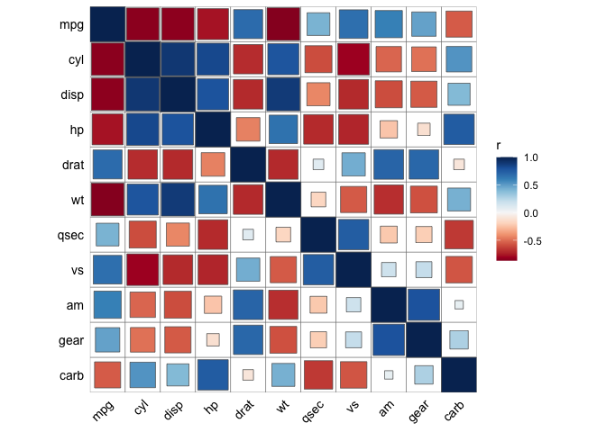
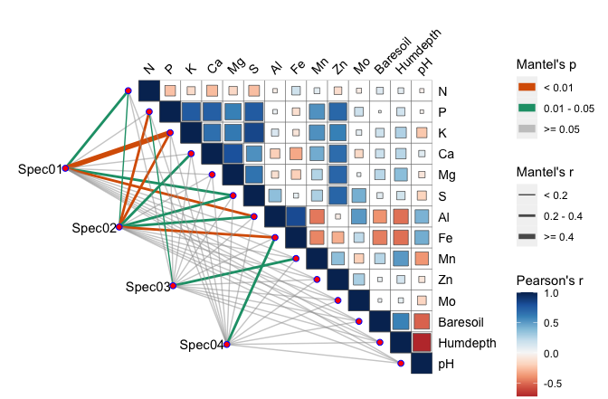

# ggcor

The `ggcor` package can be used to visualize simply and directly a
correlation matrix based on ‘ggplot2’. It provides a solution for
reordering the correlation matrix, displaying the different significance
level on the plot and other details. The most important parts, It also
provides a graphical display of any correlation analysis and their
combination (such as Mantel test, Partial correlation analysis, and so
on).

## Installation

Now `ggcor` is not on cran, You can install the development version of
ggcor from [GitHub](https://github.com/) with:

``` r
# install.packages("devtools")
devtools::install_github("houyunhuang/ggcor")
```

## Draw correlation plot quickly

This is a basic example which shows you how to draw correlation plot
quickly:

``` r
library(ggcor)
#> Loading required package: ggplot2
#> Registered S3 method overwritten by 'ggcor':
#>   method            from
#>   print.correlation nlme
quickcor(mtcars) + geom_colour()
```



``` r
quickcor(mtcars, type = "upper") + geom_circle2()
```


``` r
quickcor(mtcars, cor.test = TRUE) +
  geom_square(data = get_data(type = "lower", show.diag = FALSE)) +
  geom_mark(data = get_data(type = "upper", show.diag = FALSE), size = 2.5) +
  geom_abline(slope = -1, intercept = 12)
```


## Grouped by rows

``` r
grp <- mtcars$gear
quickcor(mtcars[-10], type = "lower", group = grp) + 
  geom_colour() +
  add_diaglab(hjust = 0) +
  expand_axis(x = 12) +
  remove_axis("x") +
  facet_wrap(~group)
#> Warning in cor(x, y, use = use, method = method): 标准差为零

#> Warning in cor(x, y, use = use, method = method): 标准差为零
```


## Mantel test plot

``` r
library(vegan)
#> Loading required package: permute
#> Loading required package: lattice
#> This is vegan 2.5-6
library(dplyr)
#> 
#> Attaching package: 'dplyr'
#> The following objects are masked from 'package:stats':
#> 
#>     filter, lag
#> The following objects are masked from 'package:base':
#> 
#>     intersect, setdiff, setequal, union
data("varechem")
data("varespec")
set.seed(20191224)
sam_grp <- sample(paste0("sample", 1:3), 24, replace = TRUE)
mantel01 <- fortify_mantel(varespec, varechem, group = sam_grp,
                           spec.select = list(spec01 = 1:5, 
                                              spec02 = 6:12,
                                              spec03 = 7:18,
                                              spec04 = 20:29,
                                              spec05 = 30:44),
                           mantel.fun = "mantel.randtest")
quickcor(mantel01, legend.title = "Mantel's r") + 
  geom_colour() + geom_cross() + facet_grid(rows = vars(group))
```



``` r
mantel02 <- fortify_mantel(varespec, varechem, 
                         spec.select = list(1:10, 5:14, 7:22, 9:32)) %>% 
  mutate(r = cut(r, breaks = c(-Inf, 0.25, 0.5, Inf), 
                 labels = c("<0.25", "0.25-0.5", ">=0.5"),
                 right = FALSE),
         p.value = cut(p.value, breaks = c(-Inf, 0.001, 0.01, 0.05, Inf),
                       labels = c("<0.001", "0.001-0.01", "0.01-0.05", ">=0.05"),
                       right = FALSE))
quickcor(varechem, type = "upper") + geom_square() + 
  add_link(mantel02, mapping = aes(colour = p.value, size = r),
           diag.label = TRUE) +
  scale_size_manual(values = c(0.5, 1.5, 3)) +
  add_diaglab() + remove_axis("x")
```


