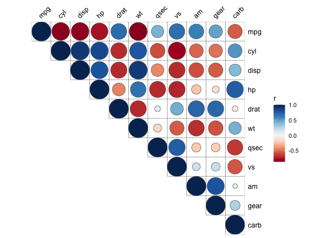
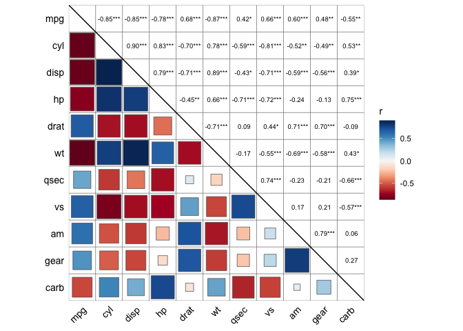
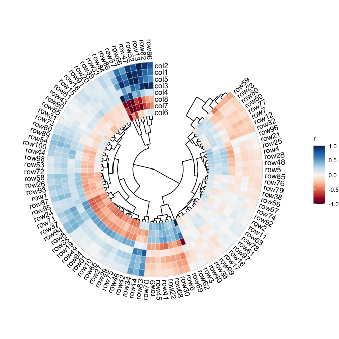
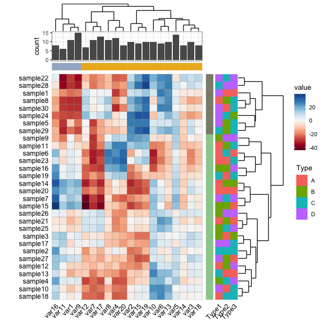

# ggcor

The goal of `ggcor` is to provide a set of functions that can be used to
visualize a correlation matrix quickly.

## Installation

Now `ggcor` is not on cran, You can install the development version of
ggcor from [GitHub](https://github.com/) with:

``` r
# install.packages("devtools")
devtools::install_github("houyunhuang/ggcor")
```

## Correlation plot

``` r
library(ggplot2)
library(ggcor)
quickcor(mtcars) + geom_square()
```


``` r
quickcor(mtcars, type = "upper") + geom_circle2()
```



``` r
quickcor(mtcars, cor.test = TRUE) +
  geom_square(data = get_data(type = "lower", show.diag = FALSE)) +
  geom_mark(data = get_data(type = "upper", show.diag = FALSE), size = 2.5) +
  geom_abline(slope = -1, intercept = 12)
```



## Mantel test plot

``` r
library(dplyr)
data("varechem", package = "vegan")
data("varespec", package = "vegan")

mantel <- mantel_test(varespec, varechem,
                      spec.select = list(Spec01 = 1:7,
                                         Spec02 = 8:18,
                                         Spec03 = 19:37,
                                         Spec04 = 38:44)) %>% 
  mutate(rd = cut(r, breaks = c(-Inf, 0.2, 0.4, Inf),
                  labels = c("< 0.2", "0.2 - 0.4", ">= 0.4")),
         pd = cut(p.value, breaks = c(-Inf, 0.01, 0.05, Inf),
                  labels = c("< 0.01", "0.01 - 0.05", ">= 0.05")))

quickcor(varechem, type = "upper") +
  geom_square() +
  anno_link(aes(colour = pd, size = rd), data = mantel) +
  anno_link_label(geom = "label") +
  scale_size_manual(values = c(0.5, 1, 2)) +
  scale_colour_manual(values = c("#D95F02", "#1B9E77", "#A2A2A288")) +
  guides(size = guide_legend(title = "Mantel's r",
                             override.aes = list(colour = "grey35"), 
                             order = 2),
         colour = guide_legend(title = "Mantel's p", 
                               override.aes = list(size = 3), 
                               order = 1),
         fill = guide_colorbar(title = "Pearson's r", order = 3))
```


## Circular heatmap

``` r
rand_correlate(100, 8) %>% ## require ambient packages
  quickcor(circular = TRUE, cluster = TRUE) +
  geom_colour(colour = "white", size = 0.125) +
  anno_tree()
```



## General heatmap

``` r
cols <- RColorBrewer::brewer.pal(4, "Set2")
rand_dataset(vars = 8) %>% ## require ambient packages
  gcor_tbl("var", cluster = TRUE) %>% 
  quickcor(circular = TRUE, cluster = TRUE, open = 30, 
           bcols = list(row.bcols = cols)) +
  geom_colour(aes(fill = var), colour = NA) +
  anno_tree() +
  scale_fill_viridis_c()
```



# Citation

To cite the `ggcor` package in publications
use:

``` 
  Houyun Huang, Lei Zhou, Jian Chen and Taiyun Wei(2020). ggcor: Extended tools for correlation analysis and visualization. R package version 0.9.6.
```

A BibTeX entry for LaTeX users is

``` 
  @Manual{,
    title = {ggcor: Extended tools for correlation analysis and visualization},
    author = {Houyun Huang, Lei Zhou, Jian Chen and Taiyun Wei},
    year = {2020},
    note = {R package version 0.9.6},
    url = {https://github.com/houyunhuang/ggcor},
  }
```

The above citation information can be generated by calling
`citation("ggcor")` in R.
